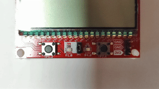

# FreeRTOS Demo with MSP430FR4133 LaunchPad
This project demonstrates FreeRTOS V10.6.0 on a Texas Instruments
MSP430FR4133 microcontroller by blinking some LEDs.

Note that this microcontroller is quite resource-limited, so a FreeRTOS
project is only suitable for very small projects.

## Build
The CMake build system automatically fetches the FreeRTOS Kernel V10.6.0
and my [port](https://github.com/stgloorious/freertos-port-gcc-msp430fr4133)
for the MSP430FR4133 microcontroller.

~~~
cmake -B build && make -C build
~~~
